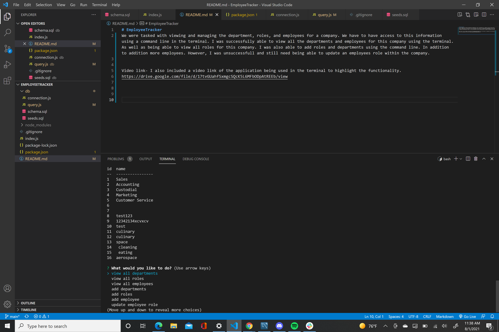
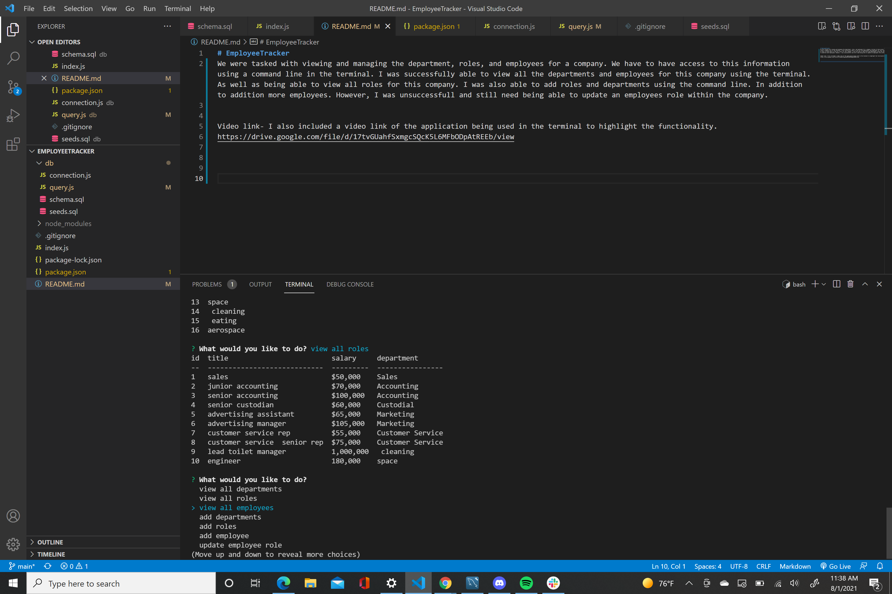

# EmployeeTracker
We were tasked with viewing and managing the department, roles, and employees for a company. We have to have access to this information using a command line in the terminal. I was successfully able to view all the departments and employees for this company using the terminal. As well as being able to view all roles for this company. I was also able to add roles and departments using the command line. In addition to addition more employees. However, I was unsuccessfull and still need being able to update an employees role within the company.

Video link- I also included a video link of the application being used in the terminal to highlight the functionality.
https://drive.google.com/file/d/17tvGUahfSxmgcSQcK5L6MFbODpAtREEb/view

Screenshots- I was also able to include screenshots of the app in use in the command line

